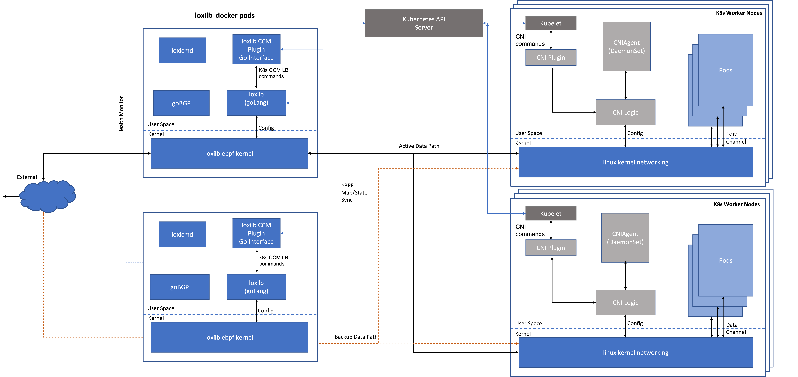

# loxilb architecture and modules

loxilb consists of the following modules :
- loxilb CCM plugin
  It fully implements K8s CCM load-balancer interface and talks to goLang based loxilb process using Restful APIs
  
- loxicmd
  loxicmd is command line tool  to configure and dump loxilb information which is based on same foundation as the wildly popular kubectl tools
  
- loxilb 
  loxilb is a modern goLang based framework (process) which mantains information coming in from various sources e.g apiserver and populates the eBPF maps used by the loxilb eBPF kernel. It also acts as a client to goBGP to exchange routes based on information from loxilb CCM. Last but not the least, it will be finally responsible for maintaining HA state sync with its remote peers. Almost all serious lb implementations need to be deployed as a HA cluster  
  
- loxilb eBPF kernel
  eBPF kernel module implements the data-plane of loxilb which provides complete kernel bypass. It is a fully self contained and feature-rich stack able to process packets from rx to tx without invoking linux native kernel networking.
  
- goBGP 
  Although goBGP is a separate project, loxilb has adopted and integrated with goBGP as its routing stack of choice. We also hope to develop features for this awesome project in the future
  
The following is a typical loxilb deployment topology (Currently HA implementation is in development) : 

